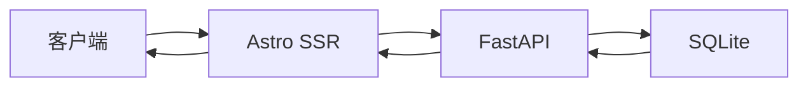
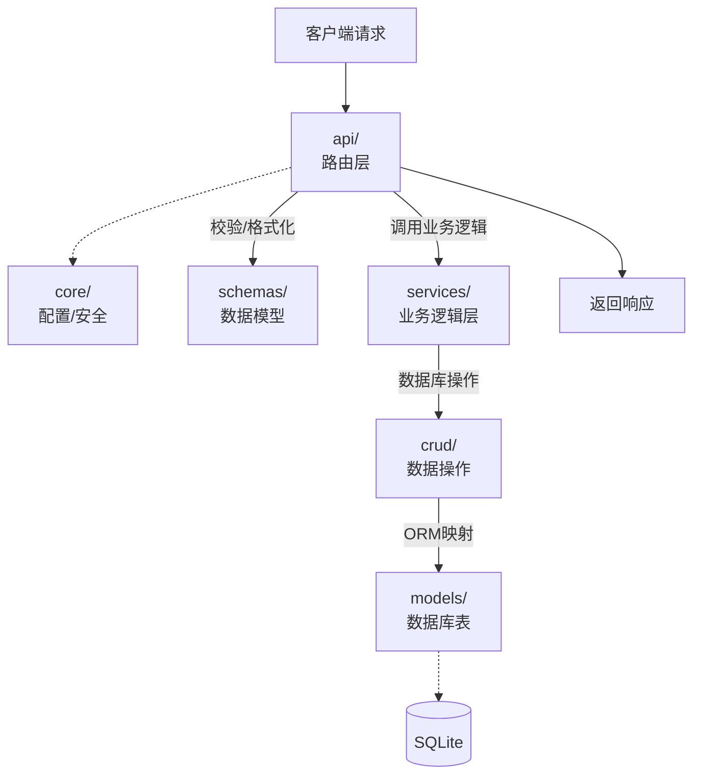

# 🌸 NayukiBlog

一个现代化的个人博客与内容管理系统，基于 **Astro + FastAPI + SQLite** 构建。


## ✨ 功能特性

### 📝 内容管理
- **文章系统** - 支持 Markdown/MDX 撰写，KaTeX 数学公式，Mermaid 流程图，代码高亮
- **日记本** - 记录日常，支持心情和天气标签
- **图库** - 图片管理与展示
- **书架** - 阅读记录与书籍管理
- **项目展示** - 个人项目与作品集
- **待办事项** - 任务管理与进度追踪
- **工具箱** - 常用工具收藏

### 🔐 双端系统

- **用户端** (`/user/*`) - 内容展示，响应式设计
- **管理端** (`/admin/*`) - 后台管理，CRUD 操作，登录认证

### 🚀 技术亮点
- ⚡️ **极速加载** - Astro Islands 架构，按需 hydration
- 📊 **数学公式** - KaTeX 渲染 LaTeX 语法
- 📈 **流程图表** - Mermaid 支持
- 🎨 **代码高亮** - Expressive Code 主题
- 🗜️ **自动压缩** - CSS/JS/HTML 压缩优化
- 🔄 **SSR 渲染** - Node.js 服务端渲染

## 🛠️ 技术栈

| 层级 | 技术 | 说明 |
|------|------|------|
| **前端框架** | [Astro 5](https://astro.build/) | 静态站点生成 + 服务端渲染 |
| **UI 组件** | Astro Components | 原生组件系统 |
| **样式** | CSS Modules | 模块化样式 |
| **Markdown** | MDX + remark/rehype | 增强 Markdown 支持 |
| **后端框架** | [FastAPI](https://fastapi.tiangolo.com/) | 高性能 Python API |
| **数据库** | SQLite + SQLAlchemy | 轻量级 ORM |
| **部署** | Node.js (SSR) | 服务端渲染模式 |

## 📂 项目结构

```
NayukiBlog/
├── app/                      # FastAPI 后端
│   ├── api/                  # API 路由
│   │   ├── admin.py          # 管理端接口
│   │   └── user.py           # 用户端接口
│   ├── core/                 # 核心配置
│   │   └── database.py       # 数据库连接
│   ├── crud/                 # 数据操作
│   │   └── blog.py           # CRUD 封装
│   ├── models/               # ORM 模型
│   │   └── blog.py           # 数据表定义
│   ├── schemas/              # Pydantic 模型
│   │   └── blog.py           # 请求/响应模型
│   ├── services/             # 业务逻辑
│   │   └── article_service.py
│   ├── utils/                # 工具函数
│   │   ├── security.py       # 安全认证
│   │   └── tag_utils.py      # 标签处理
│   ├── db_init.py            # 数据库初始化脚本
│   └── main.py               # 应用入口
│
├── frontend/                 # Astro 前端
│   ├── src/
│   │   ├── components/       # 组件
│   │   │   ├── admin/        # 管理端组件
│   │   │   └── User/         # 用户端组件
│   │   ├── layouts/          # 布局模板
│   │   │   ├── Layout.astro
│   │   │   ├── PageLayout.astro
│   │   │   └── MarkdownLayout.astro
│   │   ├── pages/            # 页面路由
│   │   │   ├── admin/        # 管理后台
│   │   │   └── user/         # 用户前台
│   │   ├── lib/              # 工具库
│   │   │   └── api.ts        # API 封装
│   │   └── styles/           # 全局样式
│   ├── public/               # 静态资源
│   │   └── lib/              # 本地依赖 (KaTeX, Mermaid)
│   └── astro.config.mjs      # Astro 配置
│
├── .env                      # 一些私人配置
├── .gitignore                
├── .python-version           # uv自动生成
├── blog.db                   # sqlite3数据库文件
├── init.ps1                  # Windows 初始化脚本
├── init.sh                   # Linux/macOS 初始化脚本
├── pyproject.toml            # uv自动生成Python 项目配置
├── uv.lock                   # uv自动生成
└── README.md
```

## 🚀 快速开始

### 环境要求

- **Python** >= 3.13
- **Node.js** >= 18
- **npm** >= 11

### 1. 克隆项目

```bash
git clone https://github.com/NayukiChiba/NayukiBlog.git
cd NayukiBlog
```


### 2. 初始化前端依赖

下载 KaTeX 和 Mermaid 本地资源（避免 CDN 连接问题）：

**Windows (PowerShell):**
```powershell
.\init.ps1
```

**Linux / macOS:**
```bash
chmod +x init.sh
./init.sh
```


### 3. 配置环境变量

在项目根目录创建 `.env` 文件：

```bash
# 前端配置
# 开发环境使用本地地址
PUBLIC_API_BASE=http://127.0.0.1:8000

# 生产环境, 等号后面不填写内容
# PUBLIC_API_BASE=
# ----------------------------------------
# 后端admin配置
ADMIN_NAME=
ADMIN_PASSWORD=
```


### 4. 启动后端

```bash
python -m venv venv
source ./venv/bin/activate
pip install uv

# 或使用 uv (推荐)
uv sync

# 初始化数据库
uv run -m app.db_init
# 启动 FastAPI 服务, 默认使用8000端口
uv run uvicorn app.main:app --reload
```

### 5. 启动前端

```bash
cd frontend

# 安装依赖
npm install

# 开发模式
npm run dev
```

前端访问：http://localhost:4321

## 🏗️ 系统架构

### 请求流程



### 后端分层架构



### 分层说明

| 层级 | 目录 | 职责 |
|------|------|------|
| **路由层** | `api/` | 定义 API 端点，处理 HTTP 请求/响应 |
| **模型层** | `schemas/` | Pydantic 模型，请求验证与响应序列化 |
| **业务层** | `services/` | 核心业务逻辑，组合多个 CRUD 操作 |
| **数据层** | `crud/` | 封装数据库 CRUD 操作 |
| **ORM层** | `models/` | SQLAlchemy 表定义 |
| **配置层** | `core/` | 数据库连接、安全认证、全局配置 |

## 📦 构建部署

### 生产环境启动

1. 更改env

2. 后端启动， 在根目录启动

```bash
uv run uvicorn app.main:app
```

3. 前端启动

```bash
cd frontend
npm run build
node dist/server/entry.mjs
```

