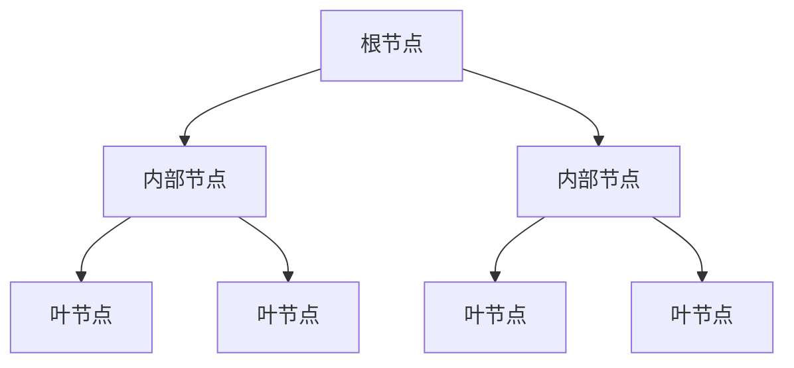

# DecisionTree

## 基本流程

决策树(decision tree)是一类常见的机器学习方法，基于树结构进行决策。以二分类任务为例，我们希望从给定训练数据集学得一个模型用以对新示例进行分类。

### 决策树结构

决策树包含三种节点：
- **根节点**：包含样本全集
- **内部节点**：对应特征测试
- **叶节点**：对应决策结果

从根节点到每个叶节点的路径对应一个判定测试序列。

### 决策树生成算法

## 划分选择

决策树学习的关键是如何选择最优划分属性。随着划分过程不断进行，我们希望结点的"纯度"(purity)越来越高。

### 信息增益（ID3算法）

#### 信息熵

数据集 $D$ 的信息熵定义为：
$$
\text{Ent}(D) = -\sum_{k=1}^{|\mathcal{Y}|} p_k \log_2 p_k
$$
其中 $p_k = \frac{|D_k|}{|D|}$ 为第 $k$ 类样本的比例。

$\text{Ent}(D)$ 的最小值为 0，最大值为 $\log_2 |\mathcal{Y}|$。$\text{Ent}(D)$ 的值越小，则 $D$ 的纯度越高。

#### 信息增益

假定离散属性 $a$ 有 $V$ 个可能取值 $\{a^1, a^2, \ldots, a^V\}$，用 $a$ 对样本集 $D$ 进行划分会产生 $V$ 个分支结点，其中第 $v$ 个分支结点包含了 $D$ 中所有在属性 $a$ 上取值为 $a^v$ 的样本，记为 $D^v$。

信息增益定义为：
$$
\text{Gain}(D,a) = \text{Ent}(D) - \sum_{v=1}^V \frac{|D^v|}{|D|} \text{Ent}(D^v)
$$

**选择准则**：选择信息增益最大的属性进行划分。

#### 示例计算

以西瓜数据集2.0为例（17个样本，8正例9反例）：

根结点信息熵：
$$
\text{Ent}(D) = -\left(\frac{8}{17} \log_2 \frac{8}{17} + \frac{9}{17} \log_2 \frac{9}{17}\right) = 0.998
$$

属性"色泽"有3个取值：
- $D^1$(色泽=青绿)：6个样本，3正3反，$\text{Ent}(D^1) = 1.000$
- $D^2$(色泽=乌黑)：6个样本，4正2反，$\text{Ent}(D^2) = 0.918$  
- $D^3$(色泽=浅白)：5个样本，1正4反，$\text{Ent}(D^3) = 0.722$

信息增益：
$$
\text{Gain}(D, \text{色泽}) = 0.998 - \left(\frac{6}{17} \times 1.000 + \frac{6}{17} \times 0.918 + \frac{5}{17} \times 0.722\right) = 0.109
$$

其他属性信息增益：
- $\text{Gain}(D, \text{根蒂}) = 0.143$
- $\text{Gain}(D, \text{敲声}) = 0.141$
- $\text{Gain}(D, \text{纹理}) = 0.381$
- $\text{Gain}(D, \text{脐部}) = 0.289$
- $\text{Gain}(D, \text{触感}) = 0.006$

选择"纹理"作为划分属性。

### 增益率（C4.5算法）

信息增益准则对可取值数目较多的属性有所偏好，为减少这种偏好，使用增益率：

$$
\text{Gain\_ratio}(D,a) = \frac{\text{Gain}(D,a)}{\text{IV}(a)}
$$

其中固有值：
$$
\text{IV}(a) = -\sum_{v=1}^{V} \frac{|D^v|}{|D|} \log_2 \frac{|D^v|}{|D|}
$$

属性 $a$ 的可能取值数目越多，则 $\text{IV}(a)$ 的值通常越大。

**选择准则**：先从候选划分属性中找出信息增益高于平均水平的属性，再从中选择增益率最高的。

### 基尼指数（CART算法）

#### 基尼值

数据集 $D$ 的基尼值：
$$
\text{Gini}(D) = \sum_{k=1}^{|\mathcal{Y}|} \sum_{k' \neq k} p_k p_{k'} = 1 - \sum_{k=1}^{|\mathcal{Y}|} p_k^2
$$

$\text{Gini}(D)$ 反映了从数据集 $D$ 中随机抽取两个样本，其类别标记不一致的概率。$\text{Gini}(D)$ 越小，则数据集 $D$ 的纯度越高。

#### 基尼指数

属性 $a$ 的基尼指数定义为：
$$
\text{Gini\_index}(D,a) = \sum_{v=1}^V \frac{|D^v|}{|D|} \text{Gini}(D^v)
$$

**选择准则**：选择基尼指数最小的属性作为最优划分属性。

## 剪枝处理

剪枝是决策树学习算法对付"过拟合"的主要手段。

### 预剪枝

在决策树生成过程中，对每个结点在划分前先进行估计，若当前结点的划分不能带来决策树泛化性能提升，则停止划分并将当前结点标记为叶结点。

**优点**：降低过拟合风险，减少训练和测试时间开销
**缺点**：基于"贪心"本质禁止某些分支展开，可能带来欠拟合风险

### 后剪枝

先从训练集生成一棵完整决策树，然后自底向上地对非叶结点进行考察，若将该结点对应的子树替换为叶结点能带来决策树泛化性能提升，则将该子树替换为叶结点。

**优点**：欠拟合风险小，泛化性能往往优于预剪枝决策树
**缺点**：训练时间开销大

#### 剪枝示例

以西瓜数据集2.0划分的训练集和验证集为例：

- **预剪枝**：根结点划分后验证集精度从42.9%提升到71.4%，允许划分；但后续划分不能提升精度，禁止划分，得到决策树桩

- **后剪枝**：生成完整决策树后，自底向上考察结点，剪枝后验证集精度提升至71.4%

## 连续值与缺失值处理

### 连续值处理

对连续属性 $a$，采用二分法(bi-partition)处理。假设 $a$ 在 $D$ 上出现 $n$ 个不同取值 $\{a^1, a^2, \ldots, a^n\}$，候选划分点集合为：
$$
T_a = \left\{ \frac{a^i + a^{i+1}}{2} \mid 1 \leq i \leq n-1 \right\}
$$

信息增益计算推广为：
$$
\text{Gain}(D,a) = \max_{t \in T_a} \text{Gain}(D,a,t) = \max_{t \in T_a} \text{Ent}(D) - \sum_{\lambda \in \{-,+\}} \frac{|D_t^\lambda|}{|D|} \text{Ent}(D_t^\lambda)
$$

### 缺失值处理

#### 问题定义
1. 如何在属性值缺失的情况下进行划分属性选择？
2. 给定划分属性，若样本在该属性上的值缺失，如何对样本进行划分？

#### 解决方案

定义：
- $\tilde{D}$：$D$ 中在属性 $a$ 上没有缺失值的样本子集
- 无缺失值样本所占的比例

$$
\rho = \displaystyle\frac{\sum_{x \in \tilde{D}} w_x}{\sum_{x \in D} w_x}
$$

- 无缺失值样本中第 $k$ 类所占的比例

$$
\tilde{p}_k = \displaystyle\frac{\sum_{x \in \tilde{D}_k} w_x}{\sum_{x \in \tilde{D}} w_x}
$$

- 无缺失值样本中在属性 $a$ 上取值 $a^v$ 的样本所占的比例

$$
\tilde{r}_v = \displaystyle\frac{\sum_{x \in \tilde{D}^v} w_x}{\sum_{x \in \tilde{D}} w_x}
$$

信息增益计算推广为：
$$
\text{Gain}(D,a) = \rho \times \text{Gain}(\tilde{D},a) = \rho \times \left( \text{Ent}(\tilde{D}) - \sum_{v=1}^V \tilde{r}_v \text{Ent}(\tilde{D}^v) \right)
$$

对于样本划分：
- 若样本在划分属性上的取值已知，划入对应子结点，权重不变
- 若样本在划分属性上的取值未知，同时划入所有子结点，权重调整为 $\tilde{r}_v \cdot w_x$

## 多变量决策树

### 传统决策树的局限性

传统决策树形成轴平行(axis-parallel)的分类边界，由若干个与坐标轴平行的分段组成。当真实分类边界复杂时，需要很多段划分才能获得较好近似，导致决策树复杂，预测时间开销大。

### 多变量决策树

多变量决策树能实现"斜划分"甚至更复杂划分。非叶结点是对属性的线性组合进行测试：
$$
\sum_{i=1}^d w_i a_i = t
$$

每个非叶结点是一个线性分类器，其中 $w_i$ 是属性 $a_i$ 的权重，$w_i$ 和 $t$ 在该结点所含的样本集和属性集上学得。

**优点**：可以简化决策树模型，处理更复杂的分类边界

## 数学推导示例

### 信息增益计算

假设数据集 $D$ 有10个样本，5个正例5个反例：
$$
\text{Ent}(D) = -\left(\frac{5}{10}\log_2\frac{5}{10} + \frac{5}{10}\log_2\frac{5}{10}\right) = 1
$$

按特征 $a$ 划分后：
- $D^1$: 3正2反，$\text{Ent}(D^1) = 0.971$
- $D^2$: 2正3反，$\text{Ent}(D^2) = 0.971$

信息增益：
$$
\text{Gain}(D, a) = 1 - \left(\frac{5}{10} \times 0.971 + \frac{5}{10} \times 0.971\right) = 0.029
$$

### 基尼指数计算

同样数据集 $D$：
$$
\text{Gini}(D) = 1 - \left[\left(\frac{5}{10}\right)^2 + \left(\frac{5}{10}\right)^2\right] = 0.5
$$

按特征 $a$ 划分后：
- $D^1$: 3正2反，$\text{Gini}(D^1) = 1 - \left[\left(\frac{3}{5}\right)^2 + \left(\frac{2}{5}\right)^2\right] = 0.48$
- $D^2$: 2正3反，$\text{Gini}(D^2) = 1 - \left[\left(\frac{2}{5}\right)^2 + \left(\frac{3}{5}\right)^2\right] = 0.48$

基尼指数：
$$
\text{Gini\_index}(D, a) = \frac{5}{10} \times 0.48 + \frac{5}{10} \times 0.48 = 0.48
$$
