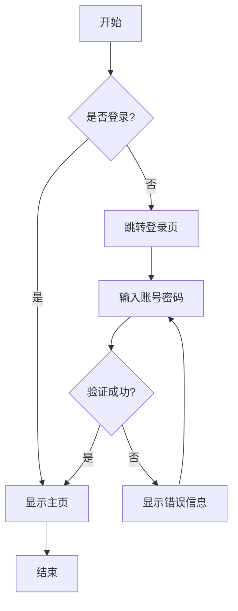
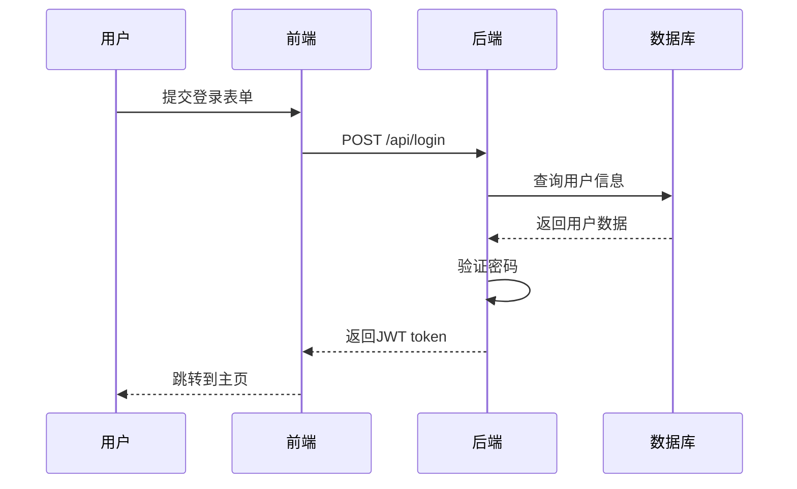
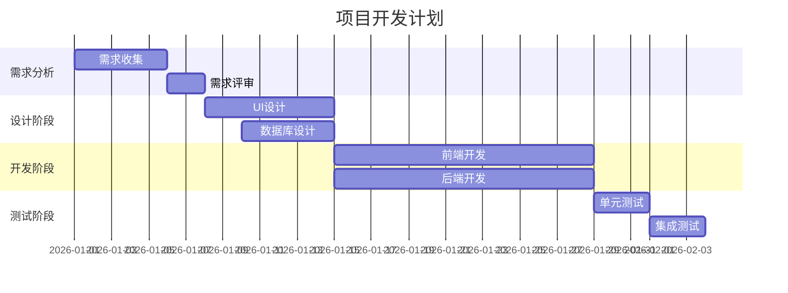

# 一级标题 - Markdown 样式完整测试

这是一个完整的 Markdown 样式测试文档，用于验证博客系统中所有样式元素的渲染效果。

## 二级标题 - 文本样式测试

### 三级标题 - 基础文本格式

这是一段**加粗文本**，这是一段*斜体文本*，这是一段**_加粗斜体文本_**。

这是一段包含`内联代码`的文本。这是一段~~删除线文本~~。

这是一个[链接示例](https://nayuki.blog)，点击可以跳转。

#### 四级标题 - 列表测试

##### 无序列表

- 第一项
  - 嵌套第一项
  - 嵌套第二项
    - 深层嵌套
- 第二项
- 第三项

##### 有序列表

1. 第一步
2. 第二步
   1. 子步骤一
   2. 子步骤二
3. 第三步

##### 任务列表

- [x] 已完成的任务
- [ ] 未完成的任务
- [x] 另一个已完成的任务
- [ ] 待办事项

## 引用块测试

> 这是一个普通的引用块。
>
> 引用块可以包含多个段落。

> **重要提示：**
>
> 引用块内也可以使用其他 Markdown 格式，比如**加粗**、*斜体*和`代码`。

## 代码块测试

### JavaScript 代码

```javascript
// 这是JavaScript代码示例
function fibonacci(n) {
  if (n <= 1) return n;
  return fibonacci(n - 1) + fibonacci(n - 2);
}

console.log(fibonacci(10)); // 55
```

### Python 代码

```python
# 这是Python代码示例
def quick_sort(arr):
    if len(arr) <= 1:
        return arr
    pivot = arr[len(arr) // 2]
    left = [x for x in arr if x < pivot]
    middle = [x for x in arr if x == pivot]
    right = [x for x in arr if x > pivot]
    return quick_sort(left) + middle + quick_sort(right)

print(quick_sort([3, 6, 8, 10, 1, 2, 1]))
```

### TypeScript 代码

```typescript
// TypeScript 接口和类型定义
interface User {
  id: number;
  name: string;
  email: string;
}

type UserResponse = {
  data: User[];
  total: number;
  page: number;
};

async function fetchUsers(): Promise<UserResponse> {
  const response = await fetch("/api/users");
  return response.json();
}
```

### SQL 代码

```sql
-- 创建用户表
CREATE TABLE users (
    id INT PRIMARY KEY AUTO_INCREMENT,
    username VARCHAR(50) NOT NULL UNIQUE,
    email VARCHAR(100) NOT NULL,
    created_at TIMESTAMP DEFAULT CURRENT_TIMESTAMP
);

-- 查询活跃用户
SELECT u.username, COUNT(p.id) as post_count
FROM users u
LEFT JOIN posts p ON u.id = p.user_id
WHERE u.is_active = TRUE
GROUP BY u.id
HAVING post_count > 5
ORDER BY post_count DESC;
```

## 表格测试

### 基础表格

| 类型  | 名称 |     内容      | 代理 |
| :---: | :--: | :-----------: | :--: |
| CNAME | www  |  domain.com   | 开启 |
|   A   |  @   |  domain.com   | 开启 |
|   A   |  \*  | 你的服务器 IP | 开启 |

### 复杂表格

|   功能   |          描述          |  状态  | 优先级 | 负责人 |
| :------: | :--------------------: | :----: | :----: | :----: |
| 用户认证 |  实现 JWT token 认证   | 已完成 |   P0   |  张三  |
| 数据导出 | 支持 Excel 和 CSV 格式 | 进行中 |   P1   |  李四  |
| 邮件通知 |    异步发送邮件通知    | 待开始 |   P2   |  王五  |
| 性能优化 |   优化数据库查询性能   | 已完成 |   P0   |  赵六  |
| 暗黑模式 |    支持暗黑主题切换    | 进行中 |   P3   |  张三  |

### 数据对比表格

| 方案       | 优点                | 缺点         | 性能       | 成本     |
| :--------: | :-----------------: | :----------: | :--------: | :------: |
| MySQL      | 成熟稳定，生态丰富  | 水平扩展困难 | ⭐⭐⭐⭐   | 💰💰     |
| PostgreSQL | 功能强大，支持 JSON | 学习曲线较陡 | ⭐⭐⭐⭐⭐ | 💰💰     |
| MongoDB    | 灵活的文档模型      | 事务支持较弱 | ⭐⭐⭐⭐   | 💰💰💰   |
| Redis      | 极高性能            | 内存占用大   | ⭐⭐⭐⭐⭐ | 💰💰💰💰 |

## 数学公式测试

### 行内公式

这是一个行内公式示例：$E = mc^2$，这是质能方程。

圆的面积公式：$A = \pi r^2$

### 块级公式

二次方程求根公式：

$$
x = \frac{-b \pm \sqrt{b^2 - 4ac}}{2a}
$$

矩阵表示：

$$
\begin{bmatrix}
a_{11} & a_{12} & a_{13} \\
a_{21} & a_{22} & a_{23} \\
a_{31} & a_{32} & a_{33}
\end{bmatrix}
$$

泰勒级数展开：

$$
f(x) = f(a) + f'(a)(x-a) + \frac{f''(a)}{2!}(x-a)^2 + \frac{f'''(a)}{3!}(x-a)^3 + \cdots
$$

欧拉公式：

$$
e^{i\pi} + 1 = 0
$$

## 图片测试

> **注意：** 图片部分需要实际的图片 URL 才能正常显示，这里仅展示 Markdown 语法。


## 分隔线测试

下面是一条分隔线：

---

上面是一条分隔线。

## Mermaid 图表测试

### 流程图



### 时序图



### 甘特图



## 嵌套复杂内容测试

### 列表中的代码块

1. 安装依赖

   ```bash
   npm install
   ```

2. 启动开发服务器

   ```bash
   npm run dev
   ```

3. 构建生产版本
   ```bash
   npm run build
   ```

### 引用中的列表

> **开发规范：**
>
> - 使用 ESLint 进行代码检查
> - 使用 Prettier 格式化代码
> - 遵循 Git 提交规范
>   - feat: 新功能
>   - fix: 修复 bug
>   - docs: 文档更新

### 表格中的代码

| 命令         | 说明       | 示例                                         |
| ------------ | ---------- | -------------------------------------------- |
| `git init`   | 初始化仓库 | `git init my-project`                        |
| `git clone`  | 克隆仓库   | `git clone https://github.com/user/repo.git` |
| `git commit` | 提交更改   | `git commit -m "feat: add new feature"`      |
| `git push`   | 推送到远程 | `git push origin main`                       |

## HTML 标签测试

<div style="background-color: #f0f0f0; padding: 1rem; border-radius: 8px; margin: 1rem 0;">
  这是一个使用HTML标签的自定义容器。
</div>

<details>
<summary>点击展开详细内容</summary>

这是隐藏的详细内容，点击上方可以展开或折叠。

- 支持 Markdown 格式
- 可以包含**加粗**和*斜体*
- 还可以包含`代码`

</details>

## 特殊字符测试

### Emoji 表情

😀 😃 😄 😁 😆 😅 😂 🤣 ❤️ 💯 🎉 🚀 ⭐ 🔥 ✅ ❌

### 特殊符号

© ® ™ § ¶ † ‡ • ‣ ⁃ ◦ ⁌ ⁍

### 数学符号

± × ÷ ≠ ≈ ≤ ≥ ∞ ∫ ∑ ∏ √ ∛ ∜

## 总结

这个测试文档涵盖了：

- ✅ 标题层级（H1-H5）
- ✅ 文本格式（加粗、斜体、删除线）
- ✅ 列表（有序、无序、任务列表）
- ✅ 引用块
- ✅ 代码块（多种语言）
- ✅ 表格（基础、复杂、数据对比）
- ✅ 数学公式（行内、块级）
- ✅ 图片
- ✅ 分隔线
- ✅ Mermaid 图表（流程图、时序图、甘特图）
- ✅ 嵌套内容
- ✅ HTML 标签
- ✅ 特殊字符和 Emoji

如果所有样式都能正确渲染，说明博客系统的 Markdown 渲染功能完整可用！
